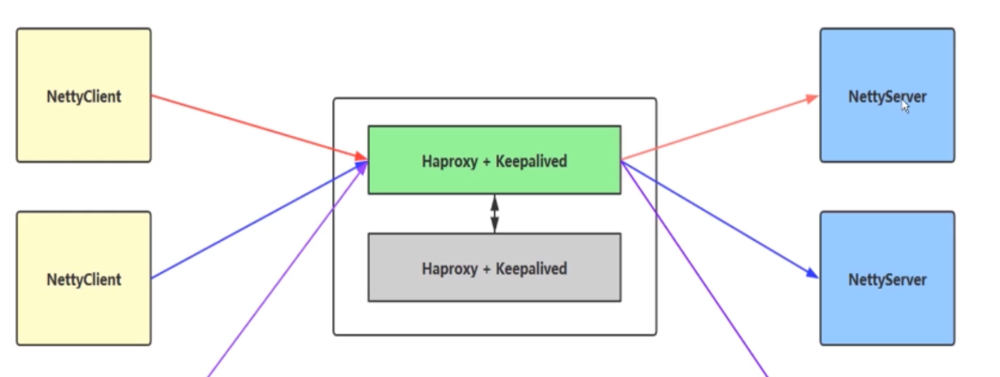
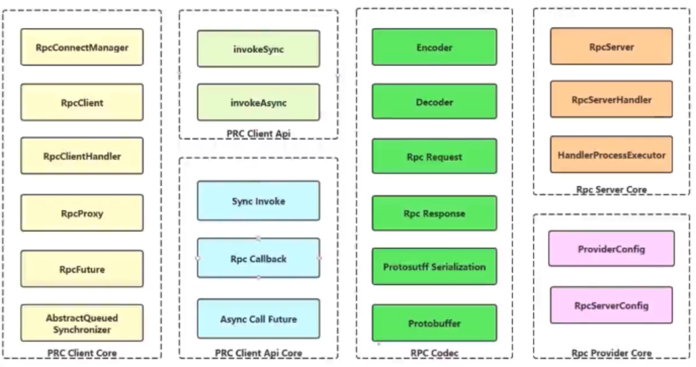

# netty-self-study
* 标准版 spring boot整合Netty
* 编写一个简单的,硬编码的RPC框架


## 下载代码

* 代码库地址 
    - [GitHub](https://github.com/telltao/netty-self-study)
    - [码云](https://gitee.com/telltao/netty-self-study)

```

 git clone git@github.com:telltao/netty-self-study.git

 or

 git clone git@gitee.com:telltao/netty-self-study.git

```
--------

### 代码结构

```
netty-self-study
|
├──netty-guidance- --Netty入门
|
├──netty-common --通用包(.proto数据文件)
|
├──netty-server- --Netty服务端
|
├──netty-client- --Netty客户端
|
├──telltao-netty-rpc- NettyRpc框架
|  |
|  ├── 一个简单的Rpc框架(AQS,Future,NIO,Proxy,异步回调,编解码器...)
|
├──telltao-netty-rpc-spring --将rpc框架整合至spring容器中(doing)
|

```

#### 什么是同步,异步,阻塞,非阻塞?
 
在讲 BIO,NIO,AIO 之前先来回顾一下这样几个概念：同步与异步，阻塞与非阻塞。以分布式系统为例：
##### 同步和异步关注的是消息通信机制(synchronous communication) 
- **同步** ：就是在发出一个`调用`时，在没有得到结果之前，该`调用`就不返回。但是一旦调用返回，就得到返回值了。
    - 小刘给小王打电话帮我找本《暗访十年》,小王去找去了，电话未挂断，一分钟后，告诉小刘，我找到了！这就是同步。 也就是说 由`调用者`主动等待这个`调用`的结果。

- **异步**： `调用`在发出之后，这个调用就直接返回了，所以没有返回结果。换句话说，当一个异步过程调用发出后，调用者不会立刻得到结果。而是在`调用`发出后，`被调用者`通过状态、通知来通知调用者，或通过回调函数处理这个调用。
    - 小刘给小王打电话帮我找本《暗访十年》,小王挂断电话去寻找，一分钟后，打电话给小刘说：我找到了！这就是异步。 也就是说 由`调用`主动通知这个`调用者`的结果。

##### 阻塞和非阻塞关注的是程序在等待调用结果（消息，返回值）时的状态.

- **阻塞：** 阻塞调用是指调用结果返回之前，当前线程会被挂起。调用线程只有在得到结果之后才会返回。
    - 小刘给小王打电话帮我找本《暗访十年》,小王去找去了，电话未挂断，此时小刘只能等着结果，他不能再接听其他电话了。

- **非阻塞：** 非阻塞调用指在不能立刻得到结果之前，该调用不会阻塞当前线程。
    - 小刘给小王打电话帮我找本《暗访十年》,小王去找去了，电话未挂断，此时小刘能去接杯水，一边玩儿去了，当然，也要过几分钟询问一下小王找到没有，直至小王返回结果。

#### 总结
##### 同步/异步是从行为角度描述事物的，而阻塞和非阻塞描述的当前事物的状态（等待调用结果时的状态）。


- **同步阻塞**
    - 小刘给小王打电话帮我找本《暗访十年》,小王去找去了，电话未挂断，此时小刘只能拿着电话等着小王找到书。

- **异步阻塞**
    - 小刘给小王打电话帮我找本《暗访十年》,小王去找去了，电话已经挂断，此时小刘只能拿着电话等着小王的回话。

- **同步非阻塞**
    - 小刘给小王打电话帮我找本《暗访十年》,小王去找去了，电话未挂断，此时小刘还去给自己倒了杯水，然后继续等着小王的回话。

- **异步非阻塞**
    - 小刘给小王打电话帮我找本《暗访十年》,小王去找去了，电话已挂断，此时小刘去接杯水，一边玩儿去了，小刘也要过几分钟询问一下小王找到没有(回调函数)，直至小王返回结果。

#### 还是不懂 ? 请看以下代码示例
* 请将以上加粗字体概念背过,并默写10遍.


* [传统OIO示例(JDK1.1)](netty-guidance/src/main/java/cn/telltao/guidance/chapter1/oio/OIOChannel.java)
* [传统NIO示例(JDK1.4)](netty-guidance/src/main/java/cn/telltao/guidance/chapter1/nio/NIOChannel.java)

* 作用: 直接调用底层API来编写OIO,NIO程序时的复杂度,有时使用错误常常会带来其他潜在的问题

* [Netty-OIO示例](netty-guidance/src/main/java/cn/telltao/guidance/chapter1/oio/NettyOIOChannel.java)

* [Netty-NIO示例](netty-guidance/src/main/java/cn/telltao/guidance/chapter1/nio/NettyNIOChannel.java)

* 在借助Netty编写OIO,NIO,它的强大之处逐渐显现而出
    - 你是不是觉得Netty好像有点用途了? 是的,你认为没错

---------

#### 如何使用Netty构建一个简单客户端?

* [简单服务端](netty-guidance/src/main/java/cn/telltao/guidance/chapter2/server/EchoServer.java)
    - [简单服务端的Handler](netty-guidance/src/main/java/cn/telltao/guidance/chapter2/server/EchoServerHandler.java)
    
* [简单客户端](netty-guidance/src/main/java/cn/telltao/guidance/chapter2/client/EchoClient.java)
    - [简单客户端的Handler](netty-guidance/src/main/java/cn/telltao/guidance/chapter2/client/EchoClientHandler.java)
    
* [Netty数据容器-ByteBuf](netty-guidance/src/main/java/cn/telltao/guidance/chapter3/chapter3.md)


    
# netty-server
* 标准版 spring boot整合Netty
  - 请查看源码

## 注意事项

##### 如何编译netty-common/proto/*.proto文件并生成消息体?
###### 不编译请忽略以下两点(已生成):


~~1.Mac OS 需提前安装 brew~~
* [安装教程](https://brew.sh/)

~~2.安装 protobuf     执行: brew install protobuf~~
* [安装教程](https://blog.csdn.net/love666666shen/article/details/89228450)


3.进行测试
* [HAProxy 安装教程](https://blog.csdn.net/wangqsse/article/details/106053776)
* [Keepalived 安装教程](https://www.cnblogs.com/dcrq/p/5642680.html)

## 部署服务
1.部署架构图
* 四台服务器 [1台 HAproxy 1台 Keepalived  2台部署 server端]

* 随后进行测试即可


### telltao-netty-rpc
* 框架架构图



## 结尾
1.如果你有疑问,请提 issues 给我 或 发送至 telltao@qq.com
* If you have any questions, please send me issues or send to telltao@qq.com


